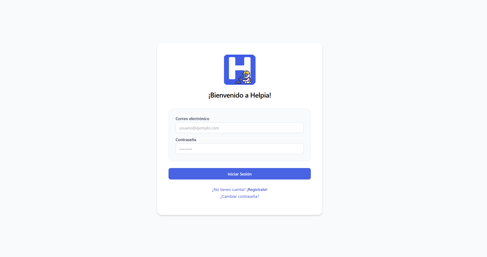
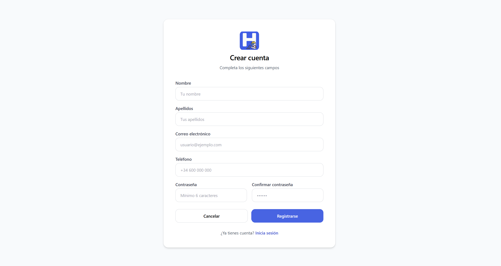
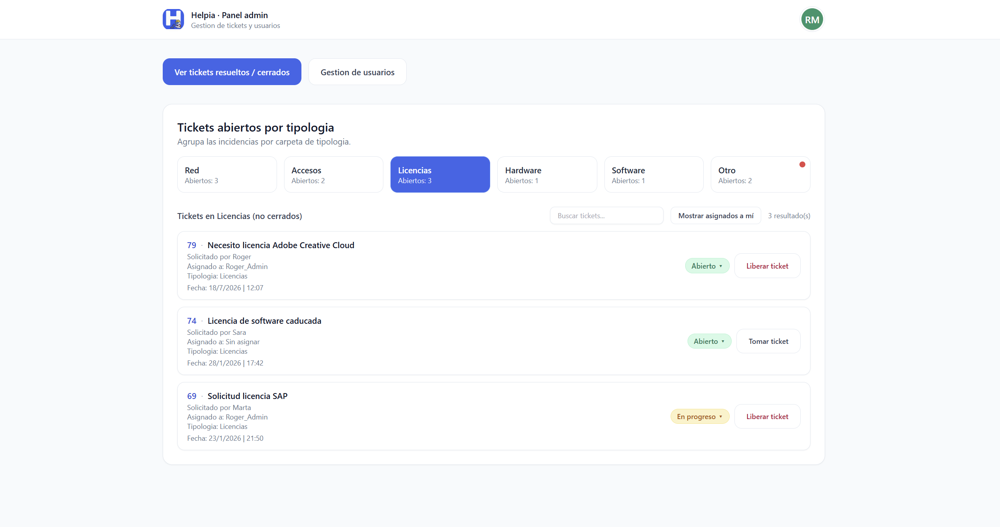
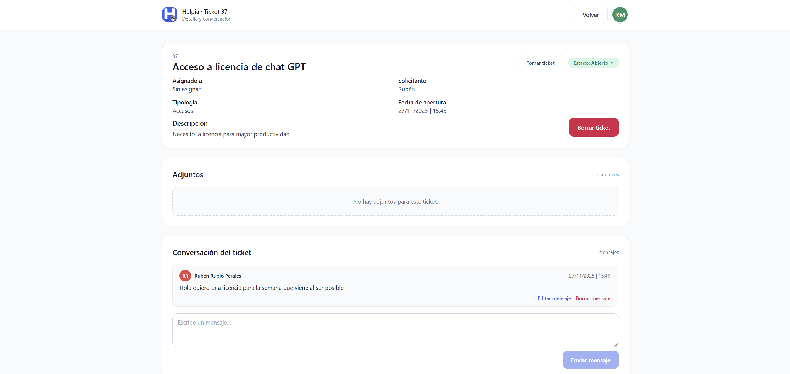
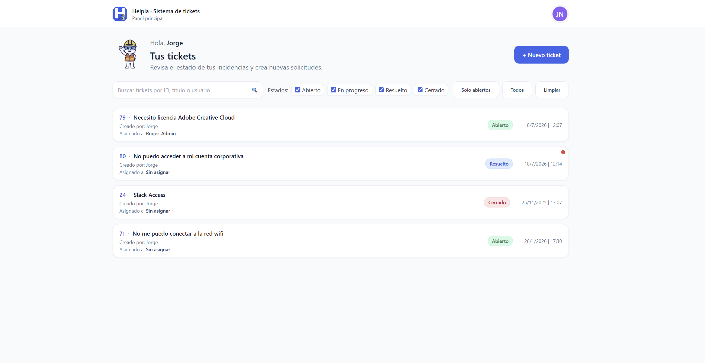
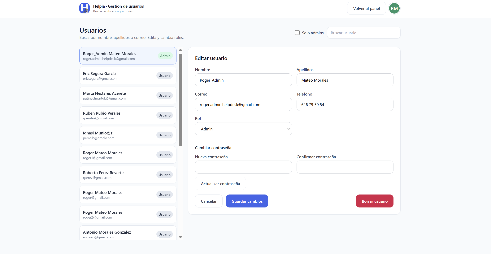

# Helpdesk IA

Aplicacion web full stack para gestionar incidencias de soporte tecnico con usuarios, roles, tickets, mensajes, adjuntos y asistencia mediante IA para sugerir respuestas o pasos de resolucion.

> Nota: las capturas e imagenes se pueden anadir despues en la seccion "Capturas". El README ya deja los huecos preparados.

## Indice

1. [Descripcion del proyecto](#descripcion-del-proyecto)
2. [Funcionalidades](#funcionalidades)
3. [Tecnologias utilizadas](#tecnologias-utilizadas)
4. [Estructura del proyecto](#estructura-del-proyecto)
5. [Requisitos previos](#requisitos-previos)
6. [Configuracion del backend](#configuracion-del-backend)
7. [Configuracion del frontend](#configuracion-del-frontend)
8. [Base de datos](#base-de-datos)
9. [Como ejecutar el proyecto](#como-ejecutar-el-proyecto)
10. [Endpoints principales](#endpoints-principales)
11. [Rutas del frontend](#rutas-del-frontend)
12. [Capturas](#capturas)
13. [Pruebas y verificacion](#pruebas-y-verificacion)
14. [Notas de seguridad](#notas-de-seguridad)

## Descripcion Del Proyecto

Helpdesk IA permite centralizar la gestion de incidencias de un servicio tecnico. Los usuarios pueden registrarse, iniciar sesion, crear tickets, consultar sus incidencias, anadir mensajes y adjuntar archivos. Los administradores pueden ver los tickets, asignarlos, cambiar estados, consultar tickets resueltos y gestionar usuarios.

El proyecto esta dividido en dos aplicaciones:

- `backend`: API REST desarrollada con Spring Boot.
- `frontend`: interfaz web desarrollada con React y Vite.

La aplicacion se conecta a una base de datos PostgreSQL y puede usar OpenAI para generar consejos o respuestas de soporte a partir de la descripcion de una incidencia.

## Funcionalidades

1. Registro de usuarios

Permite crear una cuenta con nombre, apellidos, email, telefono y contrasena. El backend asigna un rol por defecto al usuario registrado.

2. Inicio de sesion

El usuario inicia sesion con email y contrasena. El backend devuelve un token de sesion y los datos del usuario. El frontend guarda la sesion en `localStorage`.

3. Recuperacion y cambio de contrasena

El backend incluye endpoints para solicitar recuperacion de contrasena, generar un token temporal, enviar un correo mediante SMTP y actualizar la contrasena.

4. Gestion de tickets

Los usuarios pueden crear tickets con titulo, descripcion, tema y estado. Los tickets guardan fecha de creacion, ultima actualizacion y fecha de cierre cuando pasan a estado resuelto.

5. Filtros de tickets

La API permite listar todos los tickets o filtrar por usuario y estado mediante parametros de consulta.

6. Asignacion de tickets

Los administradores pueden asignar o desasignar un tecnico responsable a cada ticket.

7. Estados de ticket

Cada ticket tiene un estado relacionado con la tabla `status`. Cuando el estado cambia a `RESOLVED`, el backend rellena la fecha de cierre.

8. Mensajes en tickets

La aplicacion permite anadir mensajes a una incidencia para mantener el seguimiento de la conversacion.

9. Archivos adjuntos

Se pueden subir archivos relacionados con un ticket. El backend guarda el archivo en disco y registra la referencia en la base de datos.

10. Asistencia con IA

El endpoint de consejos recibe una descripcion del problema y consulta OpenAI para devolver una recomendacion tecnica.

11. Panel de administracion

El frontend incluye vistas de administracion para revisar tickets, tickets resueltos y usuarios.

12. Perfil de usuario

El usuario puede consultar y actualizar datos de su cuenta desde la seccion de perfil.

## Tecnologias Utilizadas

Backend:

- Java 21
- Spring Boot 3.5.6
- Spring Web
- Spring Data JPA
- Spring Security
- Spring Validation
- Spring Mail
- PostgreSQL Driver
- Maven

Frontend:

- React 19
- Vite 7
- React Router DOM
- Tailwind CSS
- ESLint

Servicios externos:

- PostgreSQL como base de datos
- Brevo SMTP para envio de correos
- OpenAI API para asistencia inteligente

## Estructura Del Proyecto

```text
helpdesk-ia/
├── backend/
│   ├── src/main/java/com/helpdesk/backend/
│   │   ├── config/          # Configuracion de seguridad y CORS
│   │   ├── controller/      # Controladores REST
│   │   ├── dto/             # Objetos de entrada/salida
│   │   ├── model/           # Entidades JPA
│   │   ├── repository/      # Repositorios de base de datos
│   │   └── service/         # Servicios de negocio e IA
│   ├── src/main/resources/
│   │   ├── application.properties
│   │   └── advice.txt
│   └── pom.xml
├── frontend/
│   ├── src/
│   │   ├── api/             # Funciones para consumir la API
│   │   ├── assets/          # Imagenes y recursos visuales
│   │   ├── components/      # Componentes reutilizables
│   │   ├── context/         # Contexto de autenticacion
│   │   ├── pages/           # Paginas de la aplicacion
│   │   ├── router/          # Proteccion de rutas
│   │   └── utils/           # Utilidades
│   ├── package.json
│   └── vite.config.js
├── attachments/             # Carpeta usada para archivos subidos
└── README.md
```

## Requisitos Previos

Antes de ejecutar el proyecto necesitas tener instalado:

1. Java 21

Comprueba la version:

```bash
java -version
```

2. Maven

El backend incluye wrapper de Maven, por lo que puedes usar `mvnw.cmd` en Windows o `./mvnw` en Linux/macOS.

3. Node.js y npm

Comprueba las versiones:

```bash
node -v
npm -v
```

4. PostgreSQL

La configuracion por defecto espera una base de datos local:

```text
Base de datos: helpdesk_db
Host: localhost
Puerto: 5432
Usuario: postgres
```

5. Clave de OpenAI opcional

Solo es necesaria si se quiere usar la funcionalidad de consejos con IA.

6. Cuenta SMTP opcional

Solo es necesaria si se quiere usar recuperacion de contrasena por correo.

## Configuracion Del Backend

El backend lee configuracion desde `backend/src/main/resources/application.properties` y tambien puede cargar variables desde `backend/.env`.

Crea o revisa el archivo `backend/.env` con este formato:

```properties
BREVO_SMTP_HOST=smtp-relay.brevo.com
BREVO_SMTP_PORT=587
BREVO_SMTP_USER=tu_usuario_smtp
BREVO_SMTP_PASS=tu_password_smtp
BREVO_MAIL_FROM=no-reply@tudominio.com
APP_RESET_URL=http://localhost:5173/reset-password
APP_RESET_MINUTES=30
APP_ATTACHMENTS_DIR=../../attachments
OPENAI_API_KEY=tu_api_key
OPENAI_MODEL=gpt-4.1-nano
```

Variables importantes:

- `BREVO_SMTP_HOST`: servidor SMTP usado para enviar correos.
- `BREVO_SMTP_PORT`: puerto SMTP. Normalmente `587`.
- `BREVO_SMTP_USER`: usuario de Brevo o del proveedor SMTP.
- `BREVO_SMTP_PASS`: contrasena o API key SMTP.
- `BREVO_MAIL_FROM`: direccion desde la que se envian los correos.
- `APP_RESET_URL`: URL del frontend para restablecer contrasena.
- `APP_RESET_MINUTES`: minutos de validez del token de recuperacion.
- `APP_ATTACHMENTS_DIR`: carpeta donde se guardan los adjuntos.
- `OPENAI_API_KEY`: clave de OpenAI.
- `OPENAI_MODEL`: modelo usado para generar consejos.

La conexion a PostgreSQL esta definida asi por defecto:

```properties
spring.datasource.url=jdbc:postgresql://localhost:5432/helpdesk_db
spring.datasource.username=postgres
spring.datasource.password=admin
```

Si tu usuario, contrasena o base de datos son diferentes, modifica esos valores en `application.properties` o adaptalos mediante variables de entorno.

## Configuracion Del Frontend

El frontend usa `VITE_API_URL` para saber donde esta el backend.

Crea o revisa el archivo `frontend/.env`:

```properties
VITE_API_URL=http://localhost:8080
```

Explicacion:

- `VITE_API_URL`: URL base del backend Spring Boot.
- En desarrollo local normalmente se usa `http://localhost:8080`.
- Vite expone al navegador solo variables que empiezan por `VITE_`.

## Base De Datos

El proyecto usa PostgreSQL y entidades JPA. Actualmente la configuracion tiene:

```properties
spring.jpa.hibernate.ddl-auto=none
```

Esto significa que Hibernate no crea ni actualiza las tablas automaticamente. La base de datos debe existir y las tablas deben estar creadas antes de arrancar el backend.

Tablas principales usadas por el proyecto:

- `user_roles`: roles de usuario.
- `"user"`: usuarios registrados.
- `status`: estados de los tickets.
- `ticket`: incidencias creadas por los usuarios.
- `ticket_message`: mensajes asociados a tickets.
- `attachment`: archivos adjuntos asociados a tickets.
- `password_reset_token`: tokens temporales de recuperacion de contrasena.

Relaciones principales:

- Un usuario pertenece a un rol.
- Un ticket tiene un usuario creador.
- Un ticket puede tener un usuario asignado.
- Un ticket pertenece a un estado.
- Un ticket puede tener varios mensajes.
- Un ticket puede tener varios adjuntos.
- Un token de recuperacion pertenece a un usuario.

Datos minimos necesarios:

- Deben existir roles en `user_roles`.
- Deben existir estados en `status`.
- El registro de usuario usa por defecto el rol con id `3`.
- El sistema puede crear o usar el usuario `system@helpdesk.local` para reasignar datos cuando se borra un usuario.

## Como Ejecutar El Proyecto

1. Clonar el repositorio

```bash
git clone <url-del-repositorio>
cd helpdesk-ia
```

2. Preparar PostgreSQL

Crea la base de datos:

```sql
CREATE DATABASE helpdesk_db;
```

Despues crea las tablas necesarias o importa el script SQL correspondiente si lo tienes fuera del repositorio.

3. Ejecutar el backend

En Windows:

```bash
cd backend
mvnw.cmd spring-boot:run
```

En Linux/macOS:

```bash
cd backend
./mvnw spring-boot:run
```

El backend arranca por defecto en:

```text
http://localhost:8080
```

Endpoint de comprobacion:

```text
GET http://localhost:8080/health
```

4. Instalar dependencias del frontend

```bash
cd frontend
npm install
```

5. Ejecutar el frontend

```bash
npm run dev
```

El frontend arranca normalmente en:

```text
http://localhost:5173
```

## Endpoints Principales

Autenticacion:

| Metodo | Ruta | Descripcion |
| --- | --- | --- |
| `POST` | `/api/auth/register` | Registra un usuario |
| `POST` | `/api/auth/login` | Inicia sesion |
| `POST` | `/api/auth/forgot-password` | Solicita recuperacion de contrasena |
| `POST` | `/api/auth/reset-password` | Restablece contrasena con token |
| `POST` | `/api/auth/change-password` | Cambia la contrasena del usuario |

Tickets:

| Metodo | Ruta | Descripcion |
| --- | --- | --- |
| `GET` | `/tickets` | Lista tickets |
| `GET` | `/tickets?mine=true&userId=1` | Lista tickets de un usuario |
| `GET` | `/tickets?statusId=1` | Lista tickets por estado |
| `GET` | `/tickets/{id}` | Obtiene un ticket |
| `POST` | `/tickets` | Crea un ticket |
| `PUT` | `/tickets/{id}` | Actualiza datos del ticket |
| `PATCH` | `/tickets/{id}/status` | Cambia el estado |
| `PATCH` | `/tickets/{id}/assign` | Asigna o desasigna responsable |
| `DELETE` | `/tickets/{id}` | Elimina un ticket |

Mensajes:

| Metodo | Ruta | Descripcion |
| --- | --- | --- |
| `GET` | `/messages` | Lista mensajes |
| `GET` | `/messages?ticketId=1` | Lista mensajes de un ticket |
| `GET` | `/messages/{id}` | Obtiene un mensaje |
| `POST` | `/messages` | Crea un mensaje |
| `PUT` | `/messages/{id}` | Actualiza un mensaje |
| `DELETE` | `/messages/{id}` | Elimina un mensaje |
| `GET` | `/tickets/{ticketId}/messages` | Lista mensajes de un ticket |
| `POST` | `/tickets/{ticketId}/messages` | Anade un mensaje a un ticket |

Adjuntos:

| Metodo | Ruta | Descripcion |
| --- | --- | --- |
| `GET` | `/attachments` | Lista adjuntos |
| `GET` | `/attachments?ticketId=1` | Lista adjuntos de un ticket |
| `GET` | `/attachments/{id}` | Obtiene un adjunto |
| `POST` | `/attachments` | Crea un registro de adjunto |
| `POST` | `/attachments/upload` | Sube un archivo con `multipart/form-data` |
| `GET` | `/attachments/files/{filename}` | Descarga un archivo |
| `PUT` | `/attachments/{id}` | Actualiza un adjunto |
| `DELETE` | `/attachments/{id}` | Elimina un adjunto |

Usuarios:

| Metodo | Ruta | Descripcion |
| --- | --- | --- |
| `GET` | `/users` | Lista usuarios |
| `GET` | `/users/{id}` | Obtiene un usuario |
| `POST` | `/users` | Crea un usuario |
| `PUT` | `/users/{id}` | Actualiza un usuario |
| `PUT` | `/users/{id}/password` | Cambia contrasena desde administracion |
| `DELETE` | `/users/{id}` | Elimina un usuario |

IA:

| Metodo | Ruta | Descripcion |
| --- | --- | --- |
| `POST` | `/advice` | Genera consejo tecnico con IA desde una descripcion |

Salud:

| Metodo | Ruta | Descripcion |
| --- | --- | --- |
| `GET` | `/health` | Comprueba que el backend responde |

## Rutas Del Frontend

| Ruta | Acceso | Descripcion |
| --- | --- | --- |
| `/login` | Publico | Inicio de sesion |
| `/register` | Publico | Registro de usuario |
| `/forgot-password` | Publico | Solicitud de recuperacion de contrasena |
| `/account` | Usuario autenticado | Perfil de usuario |
| `/tickets` | Usuario autenticado | Listado de tickets |
| `/tickets/new` | Usuario autenticado | Crear nuevo ticket |
| `/tickets/:id` | Usuario autenticado | Detalle de ticket |
| `/admin` | Administrador | Panel de administracion |
| `/admin/resolved` | Administrador | Tickets resueltos |
| `/admin/users` | Administrador | Gestion de usuarios |

## Capturas

Anade tus imagenes en una carpeta, por ejemplo:

```text
docs/screenshots/
```

Capturas del proyecto:

1. Pantalla de login



2. Pantalla de registro



3. Listado de tickets



4. Detalle de ticket



5. Panel de administracion



6. Gestion de usuarios


## Pruebas Y Verificacion

Backend:

```bash
cd backend
mvnw.cmd test
```

Frontend:

```bash
cd frontend
npm run lint
npm run build
```

Comprobaciones manuales recomendadas:

1. Abrir `http://localhost:5173`.
2. Registrar un usuario.
3. Iniciar sesion.
4. Crear un ticket.
5. Anadir un mensaje al ticket.
6. Subir un adjunto.
7. Cambiar el estado del ticket.
8. Entrar como administrador y revisar el panel.
9. Probar la recuperacion de contrasena si SMTP esta configurado.
10. Probar la ayuda de IA si `OPENAI_API_KEY` esta configurada.

## Notas De Seguridad

- Las variables sensibles como `OPENAI_API_KEY`, `BREVO_SMTP_PASS` y credenciales de base de datos no deben subirse al repositorio.
- El backend actualmente permite todas las peticiones en Spring Security mediante `anyRequest().permitAll()`. Para produccion conviene proteger endpoints con autenticacion real.
- Las contrasenas se guardan sin hash en el codigo actual. Para produccion se recomienda usar `BCryptPasswordEncoder` u otro mecanismo seguro.
- La API devuelve un token generado con `UUID`, pero no implementa validacion JWT real en el backend.
- CORS esta configurado para permitir el frontend local en `http://localhost:5173` y `http://127.0.0.1:5173`.
- Los archivos adjuntos se guardan en disco. En produccion conviene validar tipo, tamano, permisos y almacenamiento.

## Autor

Roger Mateo Morales
